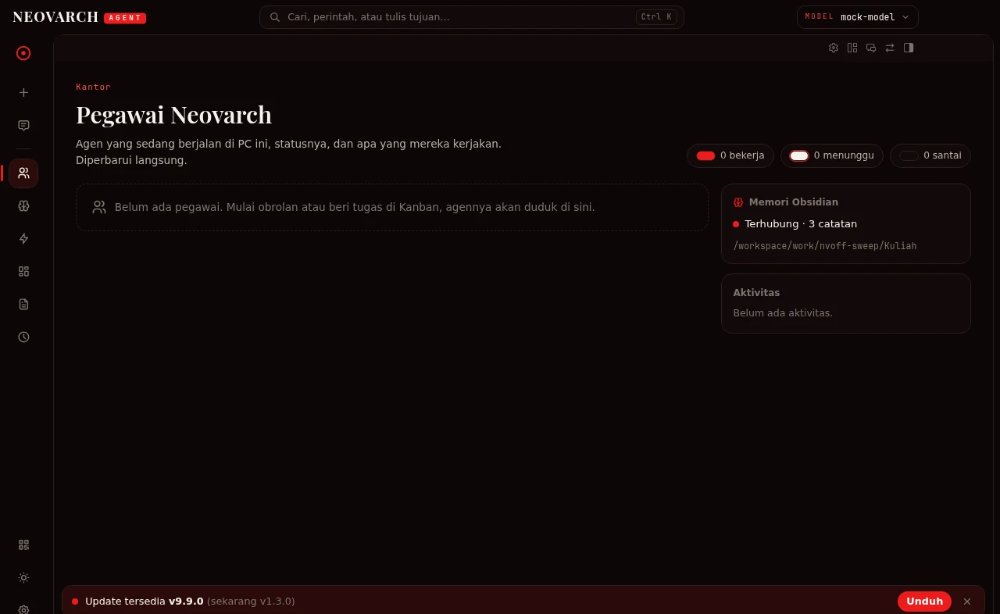
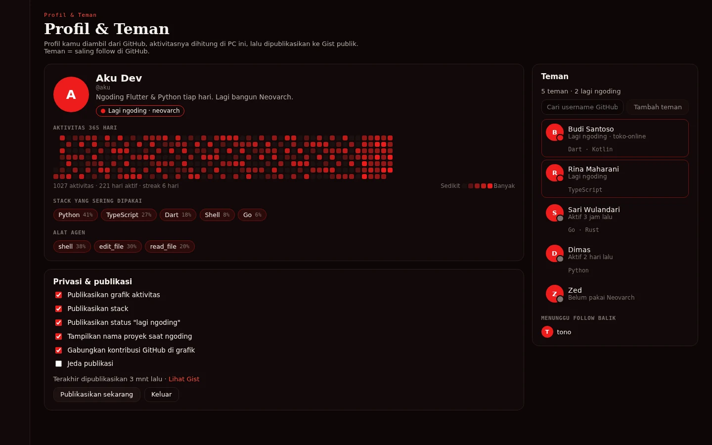
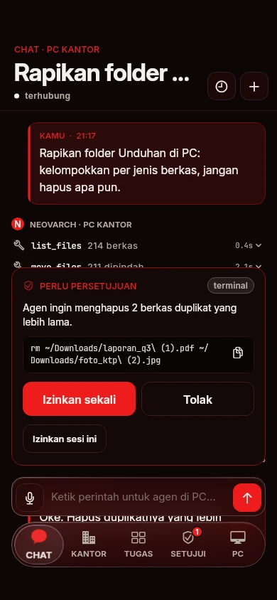
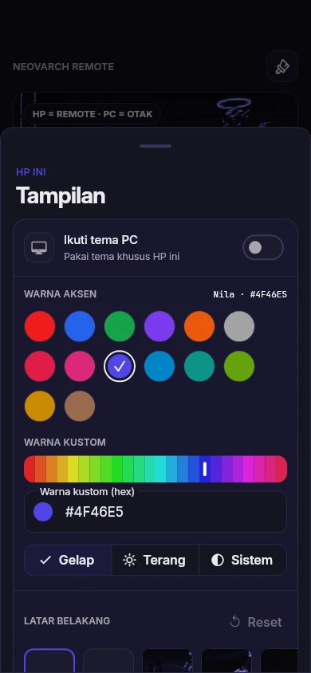
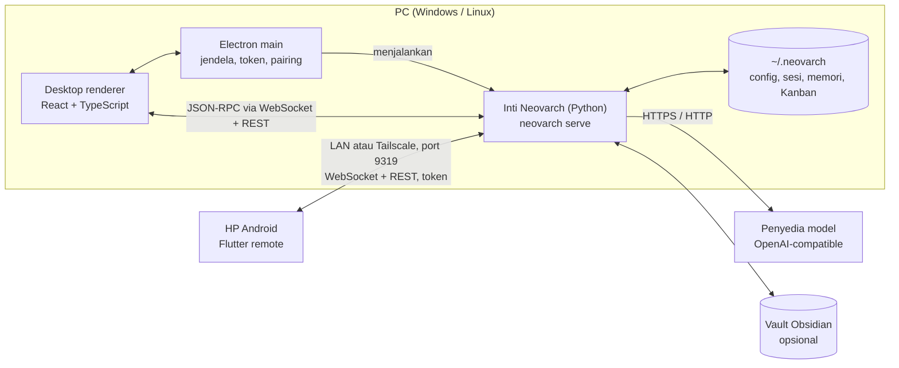

<div align="center">


# Neovarch Agent

**Agen AI yang bekerja di PC kamu sendiri, dan bisa kamu kendalikan dari HP.**

[](https://github.com/Maftuuh1922/neovrach_Agent/actions/workflows/build-apk.yml)
[](https://github.com/Maftuuh1922/neovrach_Agent/actions/workflows/desktop-electron.yml)
[](https://github.com/Maftuuh1922/neovrach_Agent/releases/latest)

[](LICENSE)


[Situs](https://maftuuh1922.github.io/neorachAgent_lp/) ·
[Unduh](https://github.com/Maftuuh1922/neovrach_Agent/releases/latest) ·
[Protokol remote](docs/remote-protocol.md) ·
[Kontribusi](CONTRIBUTING.md) ·
[English](#english)

</div>

---

Neovarch Agent dari **NeovarchLabs** terdiri dari dua aplikasi:

- **Desktop (Windows, Linux) — inti.** Aplikasi Electron + Vite + React/TypeScript yang menjalankan
  **inti Neovarch** (Python, perintah `neovarch`): chat dengan alat, sesi, skill, memori, dan papan Kanban.
  Semua data ada di `~/.neovarch`.
- **HP (Android) — remote.** Aplikasi Flutter yang tidak menjalankan agen sendiri. HP dipasangkan dengan PC
  lewat QR, lalu mengendalikan agen di PC: obrolan, persetujuan perintah, tugas, dan status.

UI berbahasa Indonesia.

<table>
  <tr>
    <td width="50%"></td>
    <td width="50%"></td>
  </tr>
  <tr>
    <td align="center"><sub>Desktop — Kantor: agen sebagai pegawai (v1.4, pengembangan)</sub></td>
    <td align="center"><sub>Desktop — Profil &amp; Teman via GitHub (v1.4, pengembangan)</sub></td>
  </tr>
</table>

<p align="center">
  
  &nbsp;&nbsp;
  
  <br>
  <sub>HP — chat dengan persetujuan perintah · pengaturan tampilan (warna aksen, gelap/terang, latar)</sub>
</p>

---

## Daftar isi

- [Fitur](#fitur)
- [Arsitektur](#arsitektur)
- [Struktur branch](#struktur-branch)
- [Instalasi](#instalasi)
- [Konfigurasi model](#konfigurasi-model)
- [Pairing HP](#pairing-hp)
- [Pengembangan & testing](#pengembangan--testing)
- [Roadmap](#roadmap)
- [Kontribusi](#kontribusi)
- [Lisensi & kredit](#lisensi--kredit)
- [English](#english)

---

## Fitur

Status: **Tersedia** = ada di rilis terbaru (v1.3.0, `main`). **v1.4** = sudah ada di kode pada branch pengembangan,
belum dirilis. **Segera** = direncanakan, belum ada kodenya.

### Desktop + inti

| Fitur | Status |
|---|---|
| Chat streaming dengan pemanggilan alat: `shell`, `read_file`, `write_file`, `edit_file`, `web_fetch`, `memory`, `skill` | Tersedia |
| Persetujuan untuk perintah berbahaya (mode `ask` / `off`) | Tersedia |
| Sesi, skill lokal, memori catatan, papan Kanban | Tersedia |
| Penyedia model siap pakai: OpenAI, OpenRouter, Groq, DeepSeek, Ollama, endpoint kustom | Tersedia |
| Gateway remote untuk HP, dikunci token (port 9319) | Tersedia |
| Installer satu baris (Linux, Windows) dan peluncur npm | Tersedia |
| **Tambah model**: endpoint OpenAI-compatible kustom, https (gateway online) atau http lokal (localhost/LAN, port bebas), API key dan header opsional, ambil daftar model, tes koneksi | v1.4 |
| **Kantor**: agen sebagai pegawai (nama, peran, status, tugas, aktivitas), live, kartu Kantor di panel samping | v1.4 |
| Tugas terjadwal (cron): interval, harian, ekspresi cron, sekali jalan | v1.4 |
| Memori Obsidian: vault dipilih di Pengaturan; cari, baca, tulis, backlink, penampil vault + graf, tombol "Buka di Obsidian" | v1.4 |
| Generator laporan/skripsi: referensi nyata dari OpenAlex, Crossref, Semantic Scholar; Markdown + BibTeX; ekspor DOCX format kampus via Pandoc; PDF via Typst atau LibreOffice | v1.4 |
| Pratinjau dokumen di aplikasi: PDF (pdf.js) dan DOCX (docx-preview) | v1.4 |
| Notifikasi update dari GitHub Releases | v1.4 |
| Pilih tema saat pertama dibuka (preset + hex kustom, gelap/terang) | v1.4 |
| Layar awal minimal (sapaan sesuai jam + kolom ketik), UI Indonesia penuh | v1.4 |
| Event real-time berurutan dengan replay saat tersambung ulang (WebSocket + SSE) | v1.4 |
| Lampiran chat (unggah hingga 25 MB, gambar ke model vision, ekstraksi teks berkas) | v1.4 |
| Profil & Teman via GitHub: login device flow, teman = saling follow, grafik aktivitas 365 hari, stack, status "lagi ngoding", dipublikasikan ke Gist publik; kartu profil untuk dibagikan | v1.4 |
| Wallpaper kustom, panel kaca, dan aksen otomatis dari wallpaper di desktop | Segera |
| Voice, MCP | Segera |

### HP (remote Android)

| Fitur | Status |
|---|---|
| Pairing lewat QR atau manual (alamat + token) | Tersedia |
| Chat: daftar sesi PC, streaming dengan aktivitas alat | Tersedia |
| Persetujuan perintah dari HP, juga lewat notifikasi Android | Tersedia |
| Papan Kanban PC, status PC, ganti/lupakan PC | Tersedia |
| Tab Kantor (pegawai + feed aktivitas live), vault Obsidian read-only + graf | v1.4 |
| Tema mengikuti PC dengan override lokal; pilih tema sejak onboarding | v1.4 |
| UI liquid glass (blur + tint datar, tanpa gradien), pilihan gaya kaca termasuk "Tanpa efek" | v1.4 |
| Latar kustom (galeri/preset) dengan slider blur, gelap, tint, kekuatan kaca; aksen otomatis dari warna latar | v1.4 |
| Navbar bawah yang bisa digeser, ikon gaya iOS, font Inter, varian warna ikon aplikasi | v1.4 |
| Sambung ulang LAN dulu lalu Tailscale, dengan keepalive dan replay event | v1.4 |
| Lampiran dari HP: foto/galeri, kamera, berkas, tempel gambar | v1.4 |
| Profil & Teman lewat PC yang dipasangkan, bagikan kartu profil | v1.4 |
| Banner "Update tersedia" | v1.4 |
| iOS | Segera (build tanpa tanda tangan dibuat CI, belum didistribusikan) |

---

## Arsitektur



- Desktop menjalankan inti sebagai proses anak dan berbicara dengannya lewat JSON-RPC 2.0 di atas WebSocket (`/api/ws`)
  plus REST.
- Akses remote membuka gateway kedua yang dikunci token untuk HP. HP tidak pernah menjalankan model sendiri.
- Detail protokol: [`docs/remote-protocol.md`](docs/remote-protocol.md).

---

## Struktur branch

| Branch | Isi |
|---|---|
| `main` | Rilis stabil (v1.3.0): desktop, inti, remote HP, installer, workflow rilis |
| `neovarch-office` | Pengembangan desktop + inti v1.4: Kantor, Tambah model, cron, Obsidian, laporan, pratinjau dokumen, update, tema |
| `neovarch-android` | Remote HP v1.4.x (versi 1.4.2): liquid glass, tema, latar kustom, navigasi baru |
| `feature-social-attach`, `feature-social-attach-android-142` | Lampiran chat dan Profil & Teman via GitHub (desktop dan HP) |
| `neovarch-core` | Inti Python milik Neovarch (sudah digabung ke `main` di v1.3.0) |
| `neovarch-ui` | Desain ulang desktop (sudah digabung di v1.3.0) |
| `neovarch-mobile` | Desain ulang HP (sudah digabung di v1.3.0) |

Landing page ada di repo terpisah: [Maftuuh1922/neorachAgent_lp](https://github.com/Maftuuh1922/neorachAgent_lp).

Isi repo:

```
desktop/        aplikasi desktop (Electron), workspace npm
core/           inti Neovarch (Python, perintah `neovarch`)
lib/            aplikasi HP (Flutter)
test/           tes Flutter
android/ ios/   proyek platform Flutter
docs/           protokol remote, catatan rilis, aset README
scripts/        installer satu baris, tes isolasi
npm/            peluncur npm
landing/        salinan lama landing page (yang aktif ada di repo terpisah)
```

Folder `linux/` dan `windows/` adalah sisa build desktop Flutter lama (v1.1.0) dan tidak lagi dirilis.

---

## Instalasi

### Dari Releases (disarankan)

Semua unduhan: <https://github.com/Maftuuh1922/neovrach_Agent/releases/latest>

| Platform | Berkas |
|---|---|
| Windows x64 | `neovarch-agent-windows-x64-setup.exe` (installer) atau `neovarch-agent-windows-x64.zip` (portabel) |
| Linux x64 | `neovarch-agent-linux-x64.AppImage`, `.deb`, atau `.tar.gz` |
| Android | `neovarch-agent-android-arm64.apk` (kebanyakan HP modern) atau `neovarch-agent-android-universal.apk` |

macOS dan Linux ARM64 belum tersedia.

### Installer satu baris

**Linux (x86_64):**

```bash
curl -fsSL https://raw.githubusercontent.com/Maftuuh1922/neovrach_Agent/main/scripts/install.sh | sh
```

Memasang inti ke `~/.neovarch/neovarch-agent`, perintah `neovarch` di `~/.local/bin`, aplikasi desktop ke
`~/.local/share/neovarch-agent`, dan entri menu aplikasi. Butuh GTK 3, NSS, ALSA, dan libsecret.
Hanya inti + CLI: `… | sh -s -- --core-only`. Versi tertentu: `… | NEOVARCH_VERSION=v1.3.0 sh`.
Hapus: `… | sh -s -- --uninstall`.

**Windows (x64), PowerShell:**

```powershell
irm https://raw.githubusercontent.com/Maftuuh1922/neovrach_Agent/main/scripts/install.ps1 | iex
```

Memasang inti ke `%LOCALAPPDATA%\neovarch\neovarch-agent`, membuat perintah `neovarch`, lalu menjalankan installer desktop
per pengguna (tanpa admin). Opsi: `-CoreOnly`, `-Portable`, `-Uninstall`.

**npm (Node.js 18+, Linux x64 / Windows x64):**

```bash
npm i -g https://github.com/Maftuuh1922/neovrach_Agent/releases/latest/download/neovarch-agent-npm.tgz
neovarch
```

Paket belum diterbitkan di registry npm; pasang dari URL rilis di atas.

### Build dari source — desktop

Butuh Node 22 dan npm 11.

```bash
cd desktop
npm ci
npm run build --workspace apps/desktop
cd apps/desktop
npx electron-builder --config electron-builder.config.cjs --linux AppImage tar.gz deb --x64   # Linux
npx electron-builder --config electron-builder.config.cjs --win nsis zip --x64               # Windows
```

Mode pengembangan dengan hot reload: `cd desktop/apps/desktop && npm run dev`.

### Build dari source — inti

Butuh Python 3.11+.

```bash
cd core
pip install -e .
neovarch setup        # pilih penyedia model
neovarch              # chat di terminal
```

### Build dari source — Android

Butuh Flutter 3.47.6 (minimal 3.38) dan JDK 17. `applicationId`: `com.neovarch.agent`.

```bash
flutter pub get
flutter build apk --release --split-per-abi   # APK per ABI
flutter build apk --release                   # APK universal
```

Kode remote v1.4 ada di branch `neovarch-android` (`git checkout neovarch-android`). Di branch itu build memakai kunci
dari `android/key.properties` agar update bisa dipasang di atas versi lama; bila berkas itu tidak ada, build memakai
kunci debug.

---

## Konfigurasi model

Inti membaca `~/.neovarch/config.yaml` (Windows: `%LOCALAPPDATA%\neovarch`), dan API key dari `~/.neovarch/.env`,
tidak pernah dari `config.yaml`. Cara termudah: `neovarch setup`, atau di desktop **Pengaturan ▸ Penyedia**.

```yaml
# ~/.neovarch/config.yaml (semua kunci opsional)
model:
  provider: openrouter          # openai | openrouter | groq | deepseek | ollama | custom
  default: openai/gpt-4o-mini   # id model yang dikirim ke penyedia
custom_providers:
  - {name: Lokal, base_url: http://127.0.0.1:4000/v1, key_env: LOKAL_API_KEY}
approvals:
  mode: ask                     # ask | off
memory:
  obsidian_vault: ""            # folder vault Obsidian (v1.4)
appearance:
  accent: "#EE1C1C"
  base: dark                    # dark | light
```

```bash
# ~/.neovarch/.env  (contoh nama variabel, isi dengan kunci milikmu sendiri)
OPENROUTER_API_KEY=...
OPENAI_API_KEY=...
```

Endpoint apa pun yang kompatibel dengan OpenAI `/chat/completions` bisa dipakai, termasuk server lokal seperti Ollama.

---

## Pairing HP

1. Di PC: **Pengaturan ▸ Remote / Perangkat ▸ Aktifkan akses remote**. Desktop menjalankan gateway kedua
   (`neovarch serve --host 0.0.0.0 --port 9319`) yang dikunci token, lalu menampilkan QR, alamat, dan token.
2. Di HP: buka Neovarch Agent ▸ **Pindai QR dari PC**, atau isi `IP-PC:9319` + token secara manual.
3. HP dan PC harus di jaringan yang sama (Wi-Fi/LAN) atau terhubung lewat Tailscale/WireGuard. Izinkan port 9319
   di firewall. Mulai v1.4, QR juga membawa alamat cadangan Tailscale (IP tailnet dan nama MagicDNS).
4. **Buat token baru** di PC mencabut akses semua HP; HP harus memindai ulang.

> Token memberi kendali penuh atas agen di PC. Di Wi-Fi umum gunakan VPN, dan jangan buka port 9319 ke internet.

---

## Pengembangan & testing

```bash
# Desktop
cd desktop && npm ci
npm run typecheck
npm test                                    # vitest (renderer + electron main)

# Inti
cd core && pip install -e '.[test]'
python -m pytest -q
python tests/mock_llm.py --port 18080       # penyedia tiruan OpenAI-compatible untuk uji manual

# HP
flutter pub get
flutter analyze
flutter test
```

CI: `build-apk.yml` (push ke `main` dan PR), `desktop-electron.yml`, `build-release.yml`, dan `build-ios.yml`
(tag `v*`). Rilis dibuat dengan mendorong tag `v*`; catatan rilis diambil dari `docs/release-notes/v<versi>.md`.

---

## Roadmap

- **v1.4.0** — gabungkan `neovarch-office`, `neovarch-android`, dan branch fitur sosial/lampiran ke `main`, lalu rilis:
  Kantor, Tambah model, cron, Obsidian, laporan, pratinjau dokumen, notifikasi update, tema, liquid glass di HP.
- **Berikutnya** — wallpaper kustom dan panel kaca di desktop; kantor bersama untuk beberapa pengguna (undang teman ke kantor
  yang sama); voice dan MCP.
- Peluncuran publik direncanakan Desember 2026.

---

## Kontribusi

Kontribusi diterima. Baca [CONTRIBUTING.md](CONTRIBUTING.md), lalu buka issue dengan templat
[laporan bug](.github/ISSUE_TEMPLATE/bug_report.md) atau [permintaan fitur](.github/ISSUE_TEMPLATE/feature_request.md).

---

## Lisensi & kredit

MIT, © 2026 Maftuuh1922 / NeovarchLabs. Lihat [`LICENSE`](LICENSE) dan [`NOTICE`](NOTICE).

- **Inti (`core/`)** adalah kode asli Neovarch. Desain dan protokolnya terinspirasi
  [Hermes Agent](https://github.com/NousResearch/hermes-agent) oleh Nous Research (MIT).
- **Desktop (`desktop/`)** diturunkan dari Hermes Desktop oleh Nous Research (MIT, © 2025 Nous Research).
  Teks lisensi dan pemberitahuan aslinya ada di [`desktop/LICENSE`](desktop/LICENSE) dan [`desktop/NOTICE`](desktop/NOTICE).
- "Hermes" adalah nama proyek Nous Research. Neovarch Agent tidak berafiliasi dengan atau didukung oleh Nous Research.
- Logo teknologi di fitur Profil memakai data jalur [Simple Icons](https://simpleicons.org) (CC0). Font Inter (OFL).

---

## English

**Neovarch Agent** is an AI agent that runs on your own PC (Windows, Linux) and can be driven from your Android phone.

- **Desktop (the core):** an Electron + React/TypeScript app that runs the Neovarch core, an original Python agent
  (`neovarch` CLI) with tool calling, sessions, skills, memory and a Kanban board. Data lives in `~/.neovarch`.
- **Phone (remote only):** a Flutter app that pairs with the PC by QR code over LAN or Tailscale (port 9319, token-protected)
  and controls the agent there: chat, command approvals, tasks, status. It never runs a model itself.
- **Install:** grab the Windows, Linux or Android build from
  [Releases](https://github.com/Maftuuh1922/neovrach_Agent/releases/latest), or use the one-line installers above.
- **Models:** any OpenAI-compatible endpoint (OpenAI, OpenRouter, Groq, DeepSeek, Ollama, or custom). Keys go in
  `~/.neovarch/.env`.
- **v1.4 (in development, not yet released):** Office view with agents as employees, custom endpoints, scheduled jobs,
  Obsidian vault memory, a report/thesis generator with real references, PDF/DOCX preview, update notices, theme picker,
  liquid-glass phone UI, chat attachments and GitHub-based profiles and friends.
- **License:** MIT. The desktop is derived from Hermes Desktop by Nous Research (MIT); the core is original code inspired
  by Hermes Agent. See `NOTICE`.

Website: <https://maftuuh1922.github.io/neorachAgent_lp/> · The app UI is in Indonesian.
